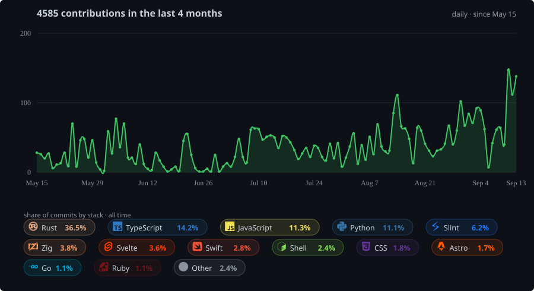
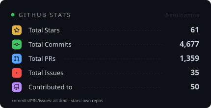
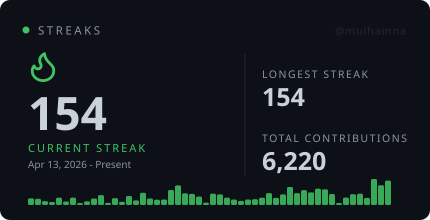

# 👋 Hi, I'm Mulham

I'm a Technical Product Manager

## Selected Projects

-  [jira-commands](https://github.com/mulhamna/jira-commands) — A Jira toolkit for terminals, coding assistants, and bots. Try it at **[jirac.keton.id](https://jirac.keton.id)**.
-  [suitest](https://github.com/suiflex/suitest) — Self-hostable, MCP-native testing platform for manual test management, & deterministic runs. Try it at **[suitest.suiflex.dev](https://suitest.suiflex.dev/)**.
-  [rdb](https://github.com/suiflex/rdb) — A Rust-built database editor. Try it at **[rdb.suiflex.dev](https://rdb.suiflex.dev/)**.
- 🤫 [cora](https://github.com/keton-id/cora) — Zero-knowledge secret injection for AI agents, written in Zig.
- 📦 [pkgmap](https://github.com/mulhamna/pkgmap) — A monitoring tool for understanding package states and dependency relationships.
-  [ForgeGuard](https://github.com/suiflex/forgeguard) - Token-efficient engineering discipline for AI coding agents.
- ⚡️ [portbar](https://github.com/mulhamna/portbar) — A lightweight Mac utility for monitoring ports and local service exposure.
- 📣 [broask](https://github.com/mulhamna/broask) — A notifier that alerts you when AI coding tools need confirmation in the terminal.
- 🚢 [addx](https://github.com/mulhamna/addx) - Transporter MCP / Skill / Plugin / Extension for CLI Agent.
- 📊 [vod](https://github.com/keton-id/vod) — A dashboard for monitoring multiple Google Meet rooms from a single view.

## Activity

## GitHub Stats

  
  &nbsp;
  

## Reach Me

  

<!---
mulhamna/mulhamna is a ✨ special ✨ repository because its `README.md` (this file) appears on your GitHub profile.
You can click the Preview link to take a look at your changes.
--->
